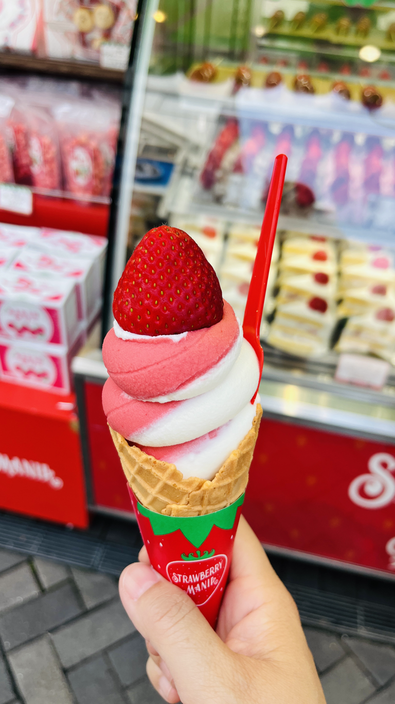
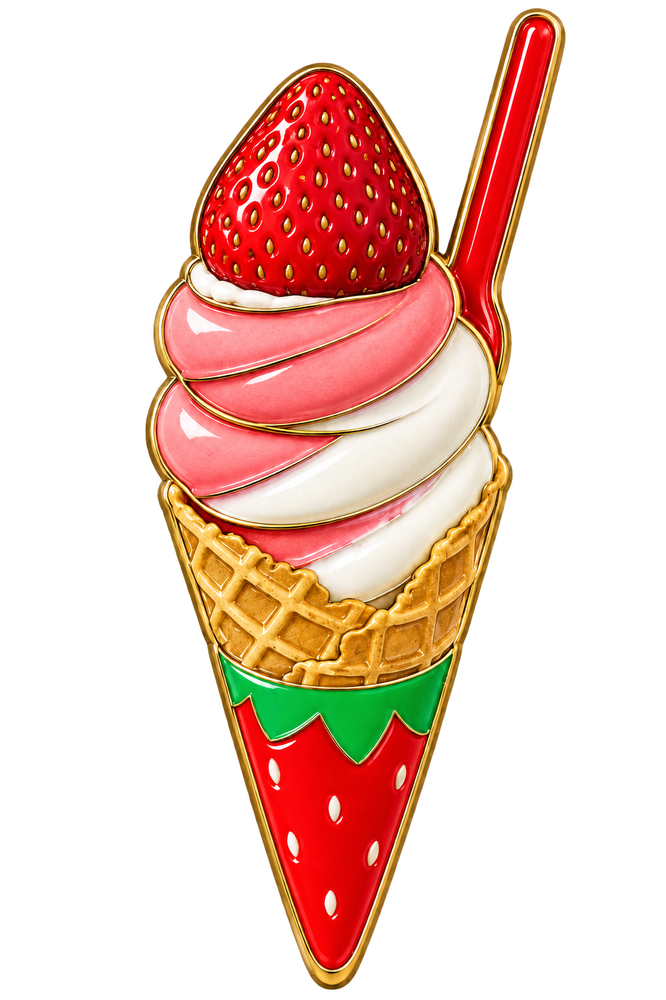

# Enamel Fridge Magnet

A Codex skill that turns a photo into one front-facing enamel fridge magnet with warm gold metal, colored enamel, shallow relief, and a transparent PNG background.

## Example

| Source photo | Finished magnet |
| --- | --- |
|  |  |

## Install

Ask Codex:

> Install the skill from https://github.com/jie5566/enamel-fridge-magnet

Then attach a photo and ask:

> Use `$enamel-fridge-magnet` to turn this photo into one transparent enamel fridge magnet.

## License

MIT
